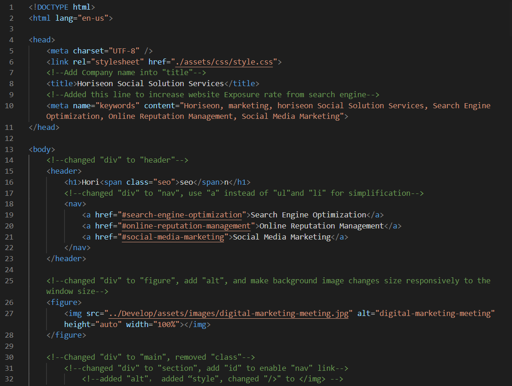
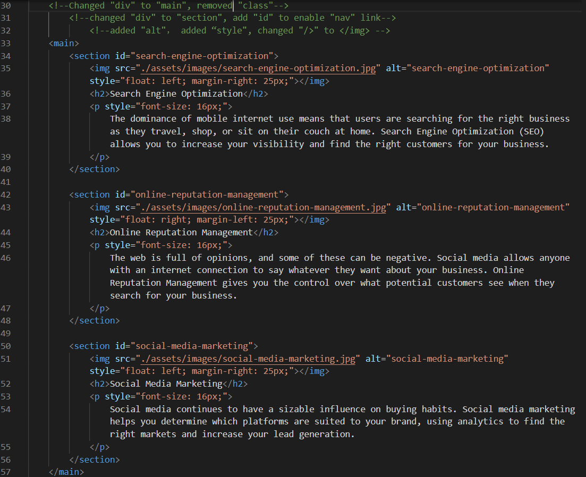
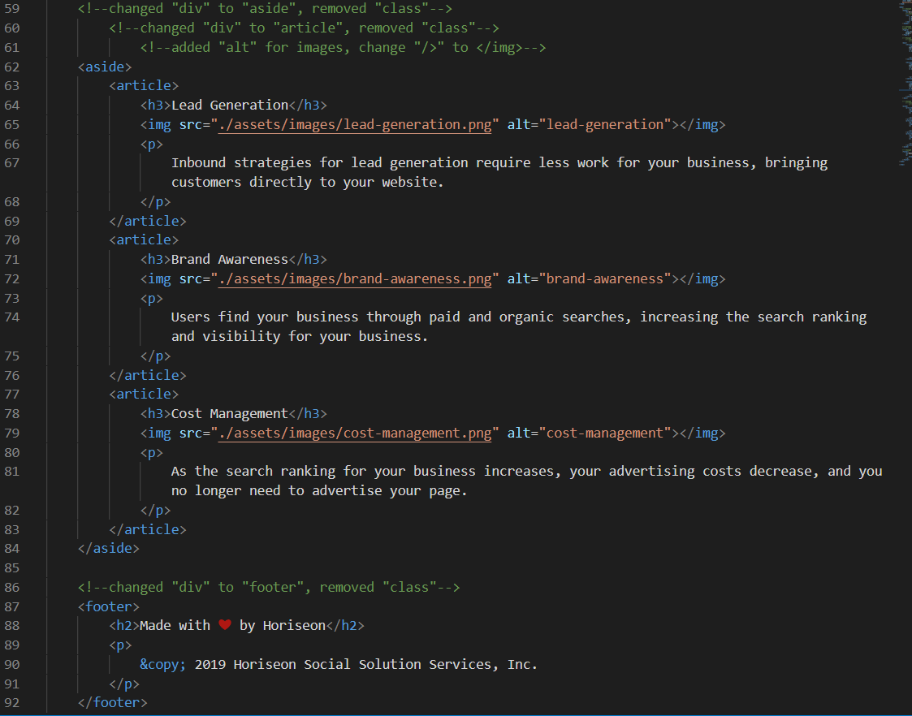
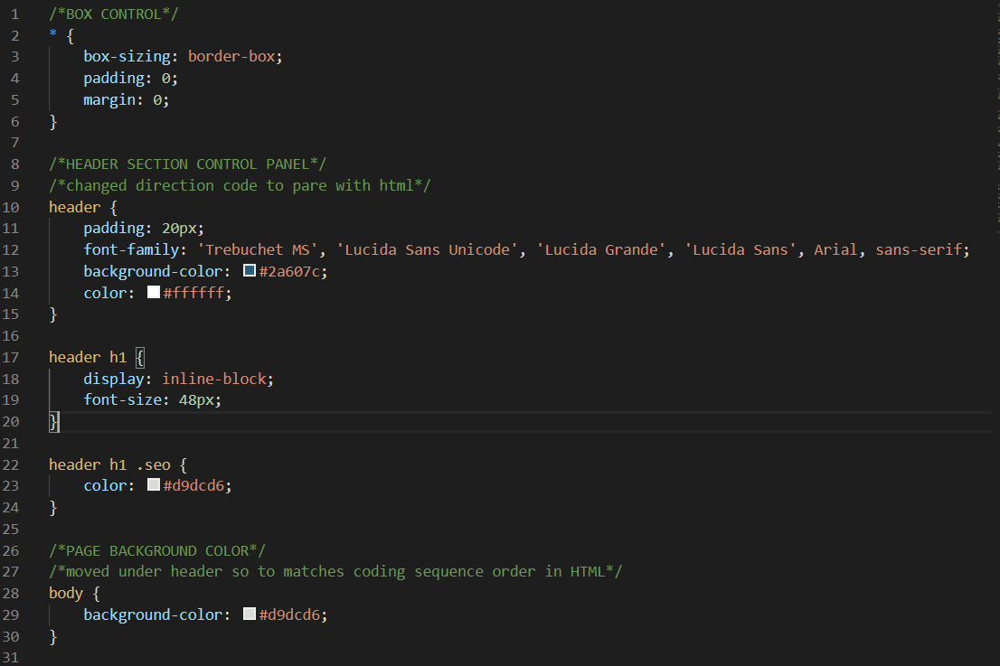
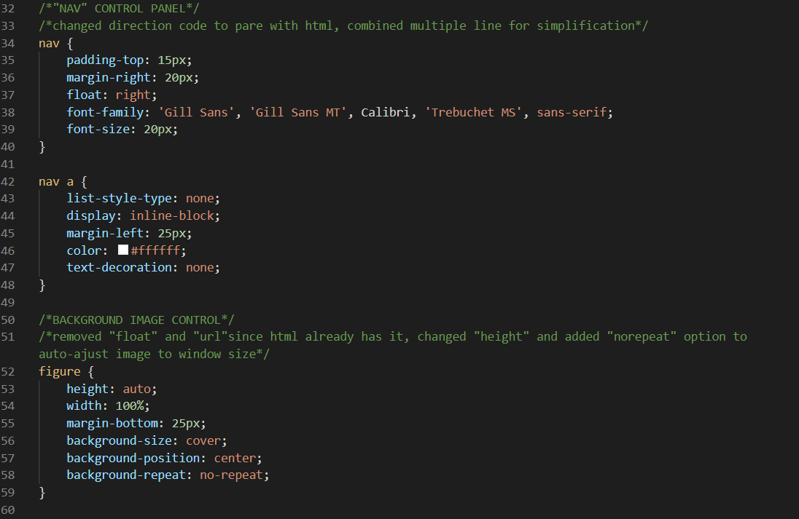
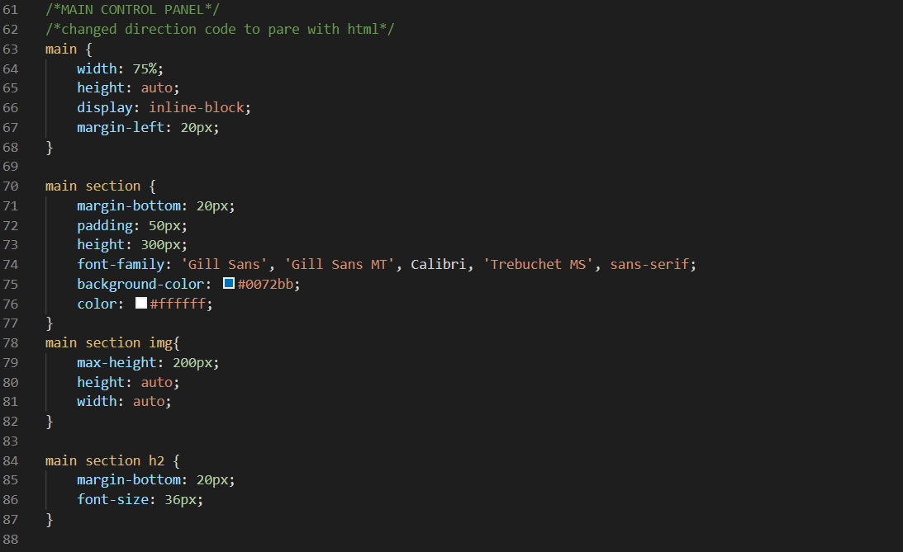
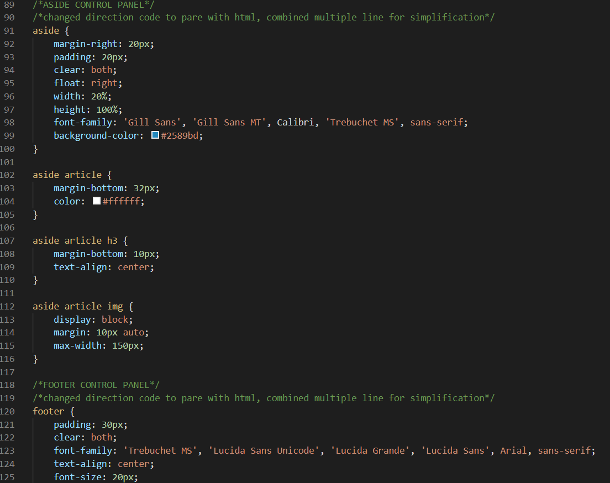

## Task

Modify and refactor original code to improve web accessibility, correct functionality, and meet semantic structure standard. 

## Revision summary

```
1. Modified inappropriate code to meet semantic structure standard. 
2. Refactored repeated code, deleted redundant line to make code cleaner.
3. Added description into the CSS file for future use.
4. Added additional functions to make website more efficient.
```

## The following images show detailed info regarding updates:

## HTML








## CSS










## LIVE URL

https://tomxli.github.io/Horiseon-Web-Project/
